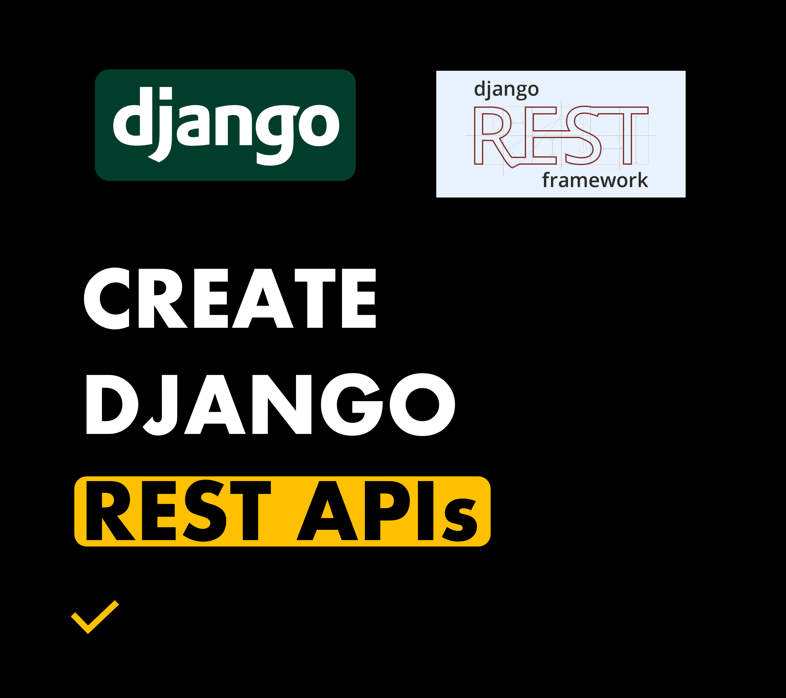
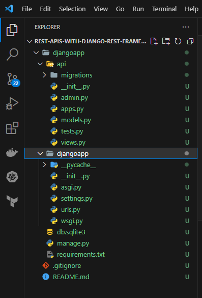
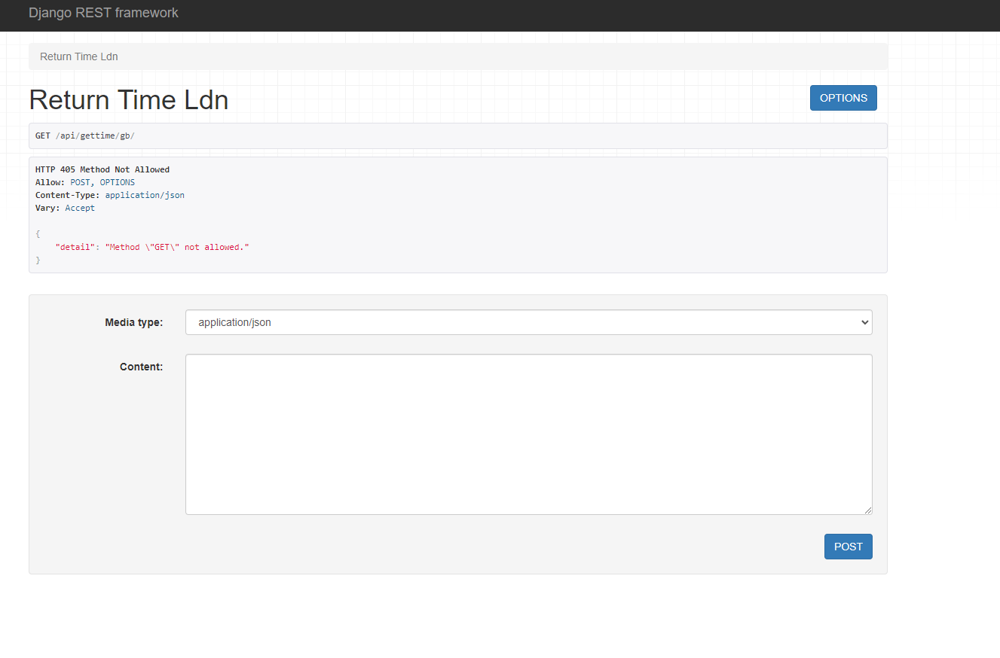
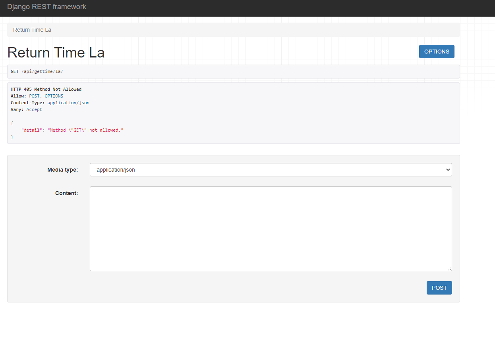
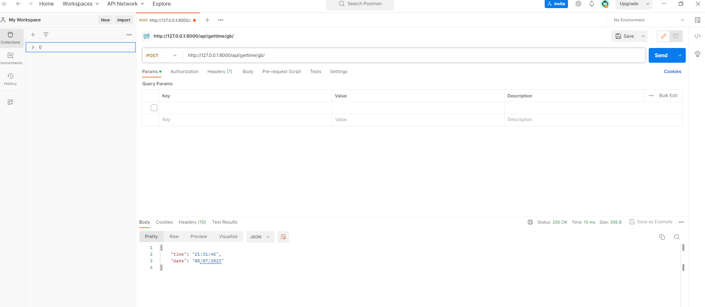
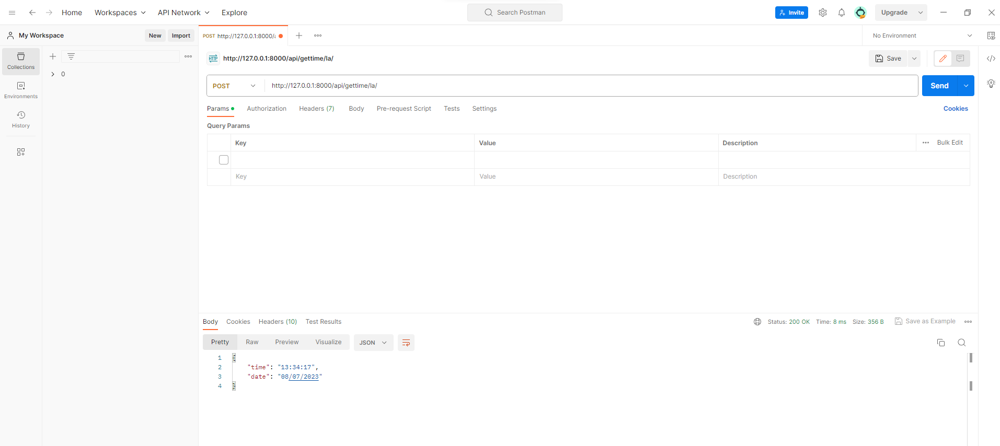

## **REST APIs with Django Rest Framework**
REST APIs

---



You will need:
- Python Installed (e.g Anaconda)
- Visual Studio Code or other IDE

Finished Links:
- [Github](https://github.com/mo-justlearnai/REST-APIs-with-Django-Rest-Framework)

Prerequisite Links:
- [Github](https://github.com/mo-justlearnai/Get-Started-with-Django)

I have worked from an existing project I created in a previous article. I have linked the github link under the prerequisite link. 

This article will assume you have followed [this](https://justlearnai.com/get-started-with-django-2023-c67a87f95d28) article carrying out the following steps:

* Downloading Anaconda or other python distribution
* Creating a virtual environment 
* Creating a Django project

Ok, the plan for this project is to create a REST API that'll tell us the date and time in Los Angeles and a REST API that'll tell us the date and time in London. 

## **1. Install Remaining Packages and Start App for REST API**

Let's install the packages required to create a REST API in django. 
I will link in a requirements.txt file so you can install the identical library versions in the root of the djangoapp. 

```shell
pip install Django djangorestframework
```

Ok, now let's start an app to hold our REST API.
I'll call my app, 'api'. 
Note: Make sure you change the working directory to the djangoapp.

```shell
python manage.py startapp api
```

A folder named api should have created after running the above command.



## **2. Configure REST API**

**2.1 Configure rest framework and django app 'api' in **settings.py**
We need to add references for django rest framework library and the app 'api' we created.

**settings.py**
```python
INSTALLED_APPS = [
    "django.contrib.admin",
    "django.contrib.auth",
    "django.contrib.contenttypes",
    "django.contrib.sessions",
    "django.contrib.messages",
    "django.contrib.staticfiles",
    
    # LIBRARIES
    "rest_framework",

    # APPS
    "api",
]

```

Ok, we'll start off by creating 2 rest framework APIViews.

**api/views.py**
```python
# ================================================== 
# Title: REST APIs (Datetime in Timezones)
# Author: Mattithyahu 
# Created Date: 08/07/2023  
# ==================================================

# Imports
# ==================================================
from rest_framework.response import Response
from rest_framework.views import APIView
from datetime import datetime
import pytz

# API View to Return Time in Europe/LDN
# ==================================================
class Return_Time_LDN(APIView):

    # POST Method
    def post(self, request):
        data = request.data
        keys = []
        values = []
        if len(data) > 0:
            for key in data:
                keys.append(key)
                values.append(data[key])

        # Getting Time as GMT / BST
        current_time = datetime.now(pytz.timezone('Europe/London')).strftime("%H:%M:%S")
        current_date = datetime.now(pytz.timezone('Europe/London')).strftime("%d/%m/%Y")

        # Response data
        data = {
            'time': current_time,
            'date': current_date,
        }

        # RESPONSE
        return Response(data, status=200)
    
    
# API View to Return Time in America/Los_Angeles
# ==================================================
class Return_Time_LA(APIView):

    # POST Method
    def post(self, request):
        data = request.data
        keys = []
        values = []
        if len(data) > 0:
            for key in data:
                keys.append(key)
                values.append(data[key])

        # Getting Time as PST / PDT
        current_time = datetime.now(pytz.timezone('America/Los_Angeles')).strftime("%H:%M:%S")
        current_date = datetime.now(pytz.timezone('America/Los_Angeles')).strftime("%d/%m/%Y")

        # Response data
        data = {
            'time': current_time,
            'date': current_date,
        }

        # RESPONSE
        return Response(data, status=200)
```

Next, we'll need to crate a urls.py file in our 'api' app so we can include it in the main django project. 

**api/urls.py**
```python
# ================================================== 
# Title: URLS
# Author: Mattithyahu 
# Created Date: 08/07/2023  
# ==================================================

# Imports
# ==================================================
from django.urls import path
import api.views as views

urlpatterns = [
    path('gettime/gb/', views.Return_Time_LDN.as_view(), name = 'api_time_gb'),
    path('gettime/la/', views.Return_Time_LA.as_view(), name = 'api_time_la'),
]

```

Lastly, we need to include the urls we have just created for our new APIs in our main project. We can do that by using the include function from django.urls

**djangoapp/urls.py**
```python
# ================================================== 
# Title: URLS
# Author: Mattithyahu 
# Created Date: 08/07/2023  
# ==================================================

# Imports
# ==================================================
from django.contrib import admin
from django.urls import path, include

urlpatterns = [
    path("admin/", admin.site.urls),
    path('api/', include('api.urls')),
]

```

## **3. Testing REST API**

Install **importlib-metadata** too, this library accesses metadata for our installed packages.

```shell
pip install importlib-metadata
```

Let's run the development server so we can test the REST APIs

```shell
python manage.py runserver
```

Navigate to http://127.0.0.1:8000/api/gettime/gb/ and http://127.0.0.1:8000/api/gettime/la/ to test our APIs.

**Testing Method 1**

The Django rest framework API view should look like this. We can only retrieve data using the POST HTTP method.





Without Content you can test the APIs by just clicking **POST**.

**Testing Method 2**

Using Postman





No content required in the POST request.

**Testing Method 3**

Using CURL

CURL is not native to Windows OS' 

You can follow steps to download CURL for windows on YouTube.

```shell
curl -X POST "http://127.0.0.1:8000/api/gettime/gb/"
# {"time":"21:38:53","date":"08/07/2023"}
```

```shell
curl -X POST "http://127.0.0.1:8000/api/gettime/la/"
# {"time":"13:39:27","date":"08/07/2023"}
```

Thanks for reading.

---
<!-- DONE -->
